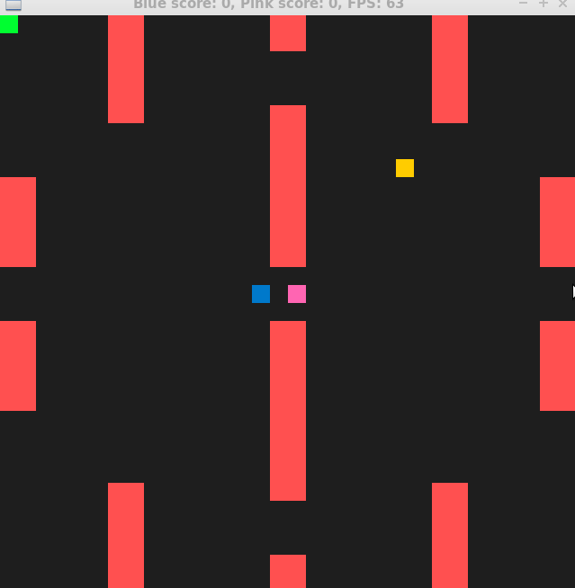

# CPPND: Capstone Snake Game Example

This is a starter repo for the Capstone project in the [Udacity C++ Nanodegree Program](https://www.udacity.com/course/c-plus-plus-nanodegree--nd213). The code for this repo was inspired by [this](https://codereview.stackexchange.com/questions/212296/snake-game-in-c-with-sdl) excellent StackOverflow post and set of responses.

The Capstone Project gives you a chance to integrate what you've learned throughout this program. This project will become an important part of your portfolio to share with current and future colleagues and employers.

Following modifications are made to the snake project:
* User Input
  * The project accepts user input to adjust the diffuculty of the snake game. Depending on the selected level (1, 2 or 3) a different map layout is loaded and the speed increase/ decrease when the snake collects food is modified.
* Reading data from a file
  * There are 3 different map layouts stored in level1.txt, level2.txt and level3.txt. In these files a "1" represents an obstacle and a "0" no obstacle. Level 1 has only a few obstacles and Level 3 has the most obstacles. When a snake collides with an obstacle the game ends for this snake.

* Poisoned food
  * In addition to the spawning of food there is spawning poisoned food. When a snake collects the poisoned food the control with the keyboard is swapped (left with right and up with down). Only when normal food is collected again the control changes back to normal. The advantage of collecting poisoned food is, that the snake speed decreases (depending on the selected level) but its always a risk because of the swapped control. So poison can be used for tactical purposes to survive longer.
* Multiplayer game 
  * A second snake is added to have a multiplayer game. The first player uses the control w, a, s,d and the second player up, down, left, right. When a snake collides with the other snake, the responsible snake dies. The other snake can continue playing and wins if its score is higher than the score of the departed snake.

## Dependencies for Running Locally
* cmake >= 3.7
  * All OSes: [click here for installation instructions](https://cmake.org/install/)
* make >= 4.1 (Linux, Mac), 3.81 (Windows)
  * Linux: make is installed by default on most Linux distros
  * Mac: [install Xcode command line tools to get make](https://developer.apple.com/xcode/features/)
  * Windows: [Click here for installation instructions](http://gnuwin32.sourceforge.net/packages/make.htm)
* SDL2 >= 2.0
  * All installation instructions can be found [here](https://wiki.libsdl.org/Installation)
  >Note that for Linux, an `apt` or `apt-get` installation is preferred to building from source. 
* gcc/g++ >= 5.4
  * Linux: gcc / g++ is installed by default on most Linux distros
  * Mac: same deal as make - [install Xcode command line tools](https://developer.apple.com/xcode/features/)
  * Windows: recommend using [MinGW](http://www.mingw.org/)

## Basic Build Instructions

1. Clone this repo.
2. Make a build directory in the top level directory: `mkdir build && cd build`
3. Compile: `cmake .. && make`
4. Run it: `./SnakeGame`.

## CC Attribution-ShareAlike 4.0 International

Shield: [![CC BY-SA 4.0][cc-by-sa-shield]][cc-by-sa]

This work is licensed under a
[Creative Commons Attribution-ShareAlike 4.0 International License][cc-by-sa].

[![CC BY-SA 4.0][cc-by-sa-image]][cc-by-sa]

[cc-by-sa]: http://creativecommons.org/licenses/by-sa/4.0/
[cc-by-sa-image]: https://licensebuttons.net/l/by-sa/4.0/88x31.png
[cc-by-sa-shield]: https://img.shields.io/badge/License-CC%20BY--SA%204.0-lightgrey.svg
